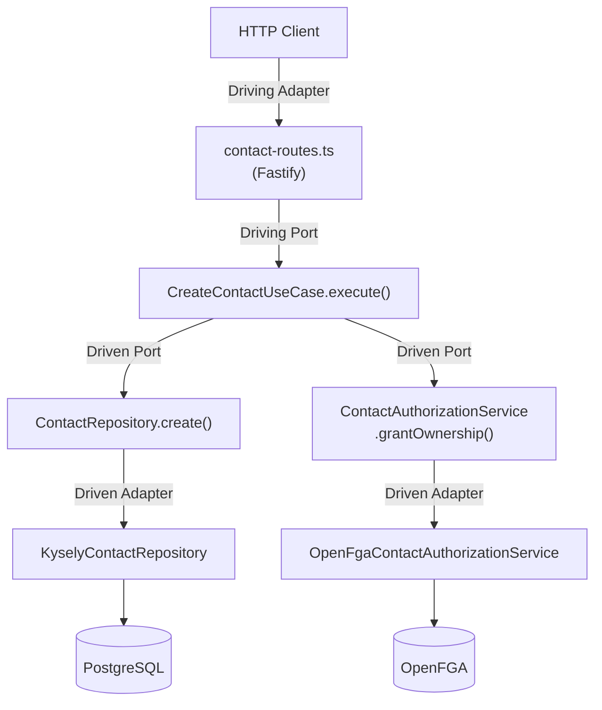

# Contact API

## 特徴

- 問い合わせフォームを実装するための API サーバー
- 動的フォームテンプレート — フォームの項目構成をテンプレートとして DB に保存し、複数種類のフォームを管理可能。フィールドごとにバリデーション種別（メールアドレス・電話番号・URL）を設定可能
- OpenFGA による関係ベースアクセス制御（ReBAC）。OpenFGA を Policy Decision Point（PDP）として認可判断を委譲
- 多言語対応（i18n）
- マルチテナント(未実装)

## 本番ビルド

```bash
docker compose --profile prod up -d
```

## 開発環境のセットアップ

### 起動手順

```bash
./setup.sh
docker compose --profile dev up -d
```

以降は dev コンテナ内で実行

```bash
npm install
npm run build
npm run migrate
npm run seed
npm run openfga:setup
```

`openfga:setup` が出力する `OPENFGA_STORE_ID` と `OPENFGA_AUTH_MODEL_ID` を指定してサーバーを起動します。

```bash
# 方法1: eval でワンライナーで環境変数をセット（ログは stderr に出力される）
eval $(node dist/src/bin/setup-openfga.js)
npm start

# 方法2: 手動で環境変数を指定
OPENFGA_STORE_ID=xxxxx OPENFGA_AUTH_MODEL_ID=yyyyy npm start
```

`.env` に設定してコンテナを再起動する方法でも問題ありません。

## 認可 (OpenFGA)

[docs/authorization.md](docs/authorization.md) を参照。認可モデルの定義は [data/openfga/model.fga](data/openfga/model.fga) にあります。

## API エンドポイント

[docs/api-endpoints.md](docs/api-endpoints.md) を参照。

## エラーレスポンス

[docs/error-responses.md](docs/error-responses.md) を参照。

## アーキテクチャ

[docs/architecture.md](docs/architecture.md) を参照。

## ヘキサゴナルアーキテクチャ（Ports and Adapters）

本プロジェクトは DDD のレイヤードアーキテクチャに、ヘキサゴナルアーキテクチャの考え方を取り入れています。アプリケーションのコアロジックを外部の技術的詳細（HTTP、データベース、認可基盤）から分離し、Port（インターフェース）と Adapter（実装）で接続します。



### Port と Adapter の対応表

| 種類 | 方向 | 役割 | ファイル |
|---|---|---|---|
| **Driving Port** | 外 → 内 | 外部がアプリケーションを駆動する入り口 | `src/application/create-contact.ts` 等 10 ユースケース |
| **Driving Adapter** | 外 → 内 | HTTP リクエストをユースケースに橋渡し | `src/presentation/contact-routes.ts`, `form-template-routes.ts`, `health-routes.ts` |
| **Driving Adapter 補助** | 外 → 内 | バリデーション・フォーマット・エラー変換 | `src/presentation/schemas.ts`, `format.ts`, `error-handler.ts`, `validation-message-formatter.ts` |
| **Driven Port** | 内 → 外 | アプリケーションが外部を利用するインターフェース | `src/domain/contact-repository.ts`, `form-template-repository.ts`, `validation-message-repository.ts`, `contact-authorization-service.ts` |
| **Driven Adapter** | 内 → 外 | Driven Port の具体的な実装 | `src/infrastructure/kysely-contact-repository.ts`, `kysely-form-template-repository.ts`, `kysely-validation-message-repository.ts`, `openfga-contact-authorization-service.ts` |
| **Domain Model** | — | ビジネスの中心概念（外部依存なし） | `src/domain/contact.ts`, `form-template.ts`, `errors.ts` |
| **Composition Root** | — | Port と Adapter を結合し依存性を注入 | `src/bin/server.ts` |

### 依存性逆転の原則（DIP）

Domain 層が `ContactRepository`、`FormTemplateRepository`、`ContactAuthorizationService` インターフェース（Driven Port）を定義し、Infrastructure 層の `KyselyContactRepository`、`KyselyFormTemplateRepository`、`OpenFgaContactAuthorizationService`（Driven Adapter）が実装します。これにより Domain 層・Application 層は具体的な DB 技術や認可基盤を知らず、Adapter の差し替えだけで技術を変更できます。

## DDD 各層の説明

### Domain 層 (`src/domain/`)

- `contact.ts` - Contact エンティティの型定義（templateId + JSONB data）
- `form-template.ts` - FormTemplate / FormField エンティティの型定義、`validateContactData` バリデーション関数（構造化エラーを返す）
- `contact-repository.ts` - ContactRepository インターフェース（Port）
- `form-template-repository.ts` - FormTemplateRepository インターフェース（Port）
- `validation-message-repository.ts` - ValidationMessageRepository インターフェース（Port）
- `contact-authorization-service.ts` - ContactAuthorizationService インターフェース（Port）
- `errors.ts` - ドメイン固有のエラークラス（AuthorizationError, FormFieldValidationError 含む）

外部ライブラリへの依存なし。純粋な TypeScript の型とクラスのみ。

### Application 層 (`src/application/`)

- 各ユースケースが 1 ファイル 1 クラス
- コンストラクタで Repository / AuthorizationService インターフェースを受け取る（DI）
- Domain 層のみに依存

### Infrastructure 層 (`src/infrastructure/`)

- `connection.ts` - Kysely DB 接続ファクトリ
- `database.ts` - Kysely 用のテーブル型定義
- `kysely-contact-repository.ts` - `ContactRepository` の Kysely 実装（Adapter）
- `kysely-form-template-repository.ts` - `FormTemplateRepository` の Kysely 実装（Adapter）
- `kysely-validation-message-repository.ts` - `ValidationMessageRepository` の Kysely 実装（Adapter）
- `openfga-connection.ts` - OpenFGA クライアントファクトリ
- `openfga-contact-authorization-service.ts` - `ContactAuthorizationService` の OpenFGA 実装（Adapter）
- `migrations/` - データベースマイグレーション

Domain 層の Repository / Authorization インターフェースを実装（依存性逆転）。

### Presentation 層 (`src/presentation/`)

- `contact-routes.ts` - 問い合わせ CRUD ルート（`X-User-Id` ヘッダー抽出含む）
- `form-template-routes.ts` - フォームテンプレート CRUD ルート
- `health-routes.ts` - ヘルスチェックルート（`/health/live`, `/health/ready`）
- `schemas.ts` - Zod バリデーションスキーマ
- `error-handler.ts` - ドメインエラー → HTTP レスポンス変換（401/403/404 含む）
- `format.ts` - Contact / FormTemplate エンティティ → JSON レスポンス変換
- `validation-message-formatter.ts` - 構造化バリデーションエラーをロケールに応じたメッセージに変換

### Composition Root (`src/bin/server.ts`)

全層を組み立てるエントリーポイント。DI コンテナの役割を果たす。
