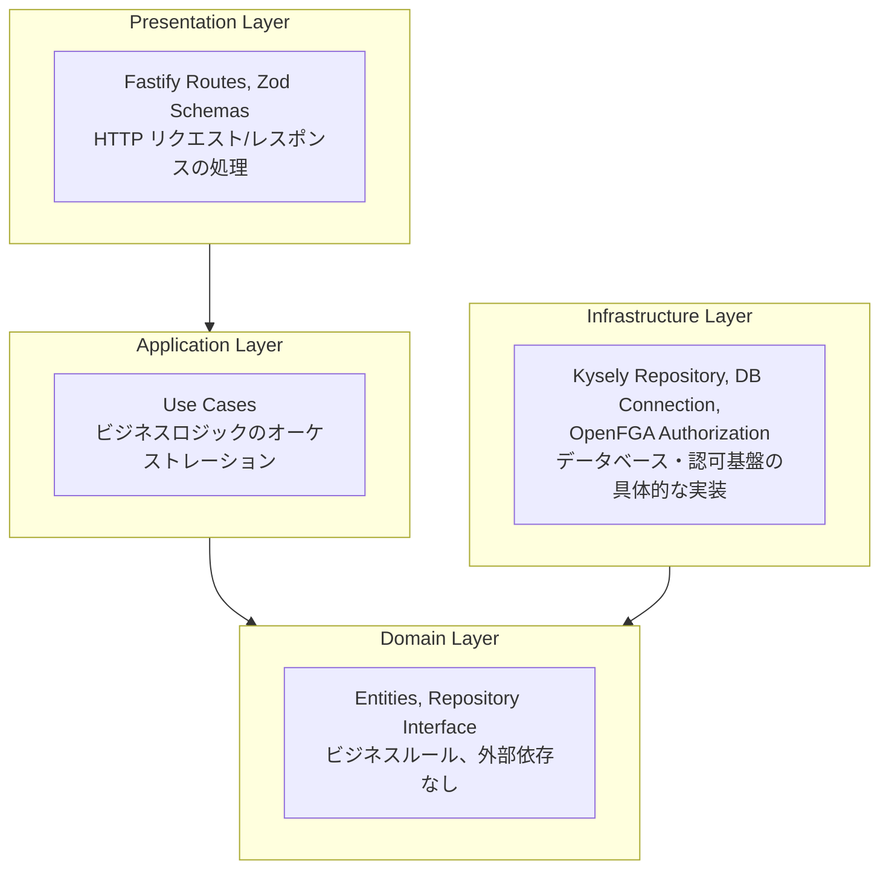
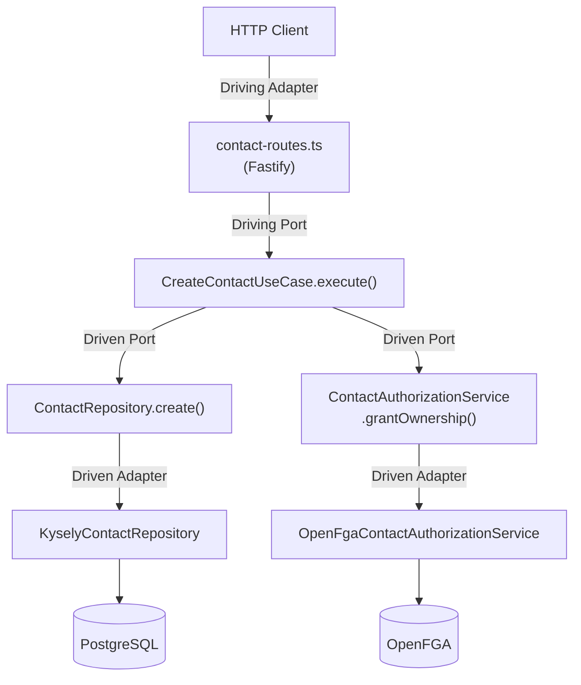

# Contact API

## 特徴

- **ヘキサゴナルアーキテクチャ（Ports and Adapters）** — Domain 層が外部ライブラリに一切依存せず、Port（インターフェース）と Adapter（実装）で接続する設計
- **OpenFGA による関係ベースアクセス制御（ReBAC）** — owner/editor/viewer のリレーション継承による柔軟な認可モデル。OpenFGA を Policy Decision Point（PDP）として認可判断を委譲
- **多言語対応（i18n）** — 問い合わせ種別がロケール別翻訳に対応
- **本番向け distroless コンテナ** — Multi-stage ビルドで軽量・安全なプロダクションイメージ

## アーキテクチャ



**依存の方向**: Presentation → Application → Domain ← Infrastructure

Domain 層は外部ライブラリに一切依存しません。Infrastructure 層が Domain 層の Repository インターフェースと Authorization インターフェースを実装します（依存性逆転の原則）。

## セットアップ

### 起動手順

```bash
./setup.sh
docker compose --profile dev up -d
```

以降は dev コンテナ内で実行

```bash
npm install
npm run build
npm run migrate
npm run seed
npm run openfga:setup
```

`openfga:setup` が出力する `OPENFGA_STORE_ID` と `OPENFGA_AUTH_MODEL_ID` を指定してサーバーを起動します。

```bash
OPENFGA_STORE_ID=xxxxx OPENFGA_AUTH_MODEL_ID=yyyyy npm start
```

`.env` に設定してコンテナを再起動する方法でも問題ありません。

### 再セットアップ

既存のデータベースを破棄して作り直す場合:

```bash
docker compose down -v
./setup.sh
docker compose --profile dev up -d
```

## 認可 (OpenFGA)

[docs/authorization.md](docs/authorization.md) を参照。

## API エンドポイント

### 問い合わせ種別一覧取得

```bash
curl -s "http://localhost:3000/contact-categories?locale=ja" | jq
```

レスポンス例:

```json
[
  { "id": 1, "name": "一般的なお問合せ", "displayOrder": 1, "createdAt": "2026-04-08T12:00:00.000Z", "updatedAt": "2026-04-08T12:00:00.000Z" },
  { "id": 2, "name": "製品/サービスについて", "displayOrder": 2, "createdAt": "2026-04-08T12:00:00.000Z", "updatedAt": "2026-04-08T12:00:00.000Z" },
  { "id": 3, "name": "採用について", "displayOrder": 3, "createdAt": "2026-04-08T12:00:00.000Z", "updatedAt": "2026-04-08T12:00:00.000Z" },
  { "id": 4, "name": "その他", "displayOrder": 4, "createdAt": "2026-04-08T12:00:00.000Z", "updatedAt": "2026-04-08T12:00:00.000Z" }
]
```

### 問い合わせ作成

```bash
curl -s -X POST http://localhost:3000/contacts \
  -H "Content-Type: application/json" \
  -H "X-User-Id: yamada" \
  -d '{"lastName": "山田", "firstName": "太郎", "email": "yamada@example.com", "phone": "090-1234-5678", "categoryId": 1, "message": "詳細を教えてください"}' | jq
```

レスポンス:
```json
{
  "id": 1,
  "lastName": "山田",
  "firstName": "太郎",
  "email": "yamada@example.com",
  "phone": "090-1234-5678",
  "categoryId": 1,
  "message": "詳細を教えてください",
  "status": "new",
  "createdAt": "2026-04-08T12:00:00.000Z",
  "updatedAt": "2026-04-08T12:00:00.000Z"
}
```

### 問い合わせ一覧取得

```bash
# 全件取得（認可済みのもののみ）
curl -s -H "X-User-Id: yamada" http://localhost:3000/contacts | jq

# ステータスでフィルタ
curl -s -H "X-User-Id: yamada" "http://localhost:3000/contacts?status=new" | jq
```

### 問い合わせ個別取得

```bash
curl -s -H "X-User-Id: yamada" http://localhost:3000/contacts/1 | jq
```

### 問い合わせステータス更新

```bash
curl -s -X PATCH http://localhost:3000/contacts/1/status \
  -H "Content-Type: application/json" \
  -H "X-User-Id: yamada" \
  -d '{"status": "in_progress"}' | jq
```

### 問い合わせ削除

```bash
curl -s -X DELETE http://localhost:3000/contacts/1 \
  -H "X-User-Id: yamada" \
  -w "\nHTTP Status: %{http_code}\n"
```

## エラーレスポンス

[docs/error-responses.md](docs/error-responses.md) を参照。

| HTTP Status | 説明 |
|-------------|------|
| 401 | `X-User-Id` ヘッダー未設定 |
| 403 | 認可エラー（該当リソースへのアクセス権なし） |

## ヘキサゴナルアーキテクチャ（Ports and Adapters）

本プロジェクトは DDD のレイヤードアーキテクチャに、ヘキサゴナルアーキテクチャの考え方を取り入れています。アプリケーションのコアロジックを外部の技術的詳細（HTTP、データベース、認可基盤）から分離し、Port（インターフェース）と Adapter（実装）で接続します。



### Port と Adapter の対応表

| 種類 | 方向 | 役割 | ファイル |
|---|---|---|---|
| **Driving Port** | 外 → 内 | 外部がアプリケーションを駆動する入り口 | `src/application/create-contact.ts` 等 6 ユースケース |
| **Driving Adapter** | 外 → 内 | HTTP リクエストをユースケースに橋渡し | `src/presentation/contact-routes.ts`, `health-routes.ts` |
| **Driving Adapter 補助** | 外 → 内 | バリデーション・フォーマット・エラー変換 | `src/presentation/schemas.ts`, `format.ts`, `error-handler.ts` |
| **Driven Port** | 内 → 外 | アプリケーションが外部を利用するインターフェース | `src/domain/contact-repository.ts`, `contact-category-repository.ts`, `contact-authorization-service.ts` |
| **Driven Adapter** | 内 → 外 | Driven Port の具体的な実装 | `src/infrastructure/kysely-contact-repository.ts`, `kysely-contact-category-repository.ts`, `openfga-contact-authorization-service.ts` |
| **Domain Model** | — | ビジネスの中心概念（外部依存なし） | `src/domain/contact.ts`, `contact-category.ts`, `errors.ts` |
| **Composition Root** | — | Port と Adapter を結合し依存性を注入 | `src/bin/server.ts` |

### 依存性逆転の原則（DIP）

Domain 層が `ContactRepository` と `ContactAuthorizationService` インターフェース（Driven Port）を定義し、Infrastructure 層の `KyselyContactRepository` と `OpenFgaContactAuthorizationService`（Driven Adapter）が実装します。これにより Domain 層・Application 層は具体的な DB 技術や認可基盤を知らず、Adapter の差し替えだけで技術を変更できます。

## DDD 各層の説明

### Domain 層 (`src/domain/`)

- `contact.ts` - Contact エンティティの型定義（姓/名分離）
- `contact-category.ts` - ContactCategory エンティティの型定義（問い合わせ種別）
- `contact-repository.ts` - ContactRepository インターフェース（Port）
- `contact-category-repository.ts` - ContactCategoryRepository インターフェース（Port）
- `contact-authorization-service.ts` - ContactAuthorizationService インターフェース（Port）
- `errors.ts` - ドメイン固有のエラークラス（AuthorizationError 含む）

外部ライブラリへの依存なし。純粋な TypeScript の型とクラスのみ。

### Application 層 (`src/application/`)

- 各ユースケースが 1 ファイル 1 クラス
- コンストラクタで Repository / AuthorizationService インターフェースを受け取る（DI）
- Domain 層のみに依存

### Infrastructure 層 (`src/infrastructure/`)

- `connection.ts` - Kysely DB 接続ファクトリ
- `database.ts` - Kysely 用のテーブル型定義
- `kysely-contact-repository.ts` - `ContactRepository` の Kysely 実装（Adapter）
- `kysely-contact-category-repository.ts` - `ContactCategoryRepository` の Kysely 実装（Adapter）
- `openfga-connection.ts` - OpenFGA クライアントファクトリ
- `openfga-contact-authorization-service.ts` - `ContactAuthorizationService` の OpenFGA 実装（Adapter）
- `migrations/` - データベースマイグレーション

Domain 層の Repository / Authorization インターフェースを実装（依存性逆転）。

### Presentation 層 (`src/presentation/`)

- `contact-routes.ts` - Fastify ルート定義（`X-User-Id` ヘッダー抽出含む）
- `health-routes.ts` - ヘルスチェックルート（`/health/live`, `/health/ready`）
- `schemas.ts` - Zod バリデーションスキーマ
- `error-handler.ts` - ドメインエラー → HTTP レスポンス変換（401/403/404 含む）
- `format.ts` - Contact エンティティ → JSON レスポンス変換

### Composition Root (`src/bin/server.ts`)

全層を組み立てるエントリーポイント。DI コンテナの役割を果たす。

## 本番ビルド

```bash
docker compose --profile prod up -d
```

Multi-stage ビルドで distroless イメージを使用した軽量な本番コンテナが起動します。
