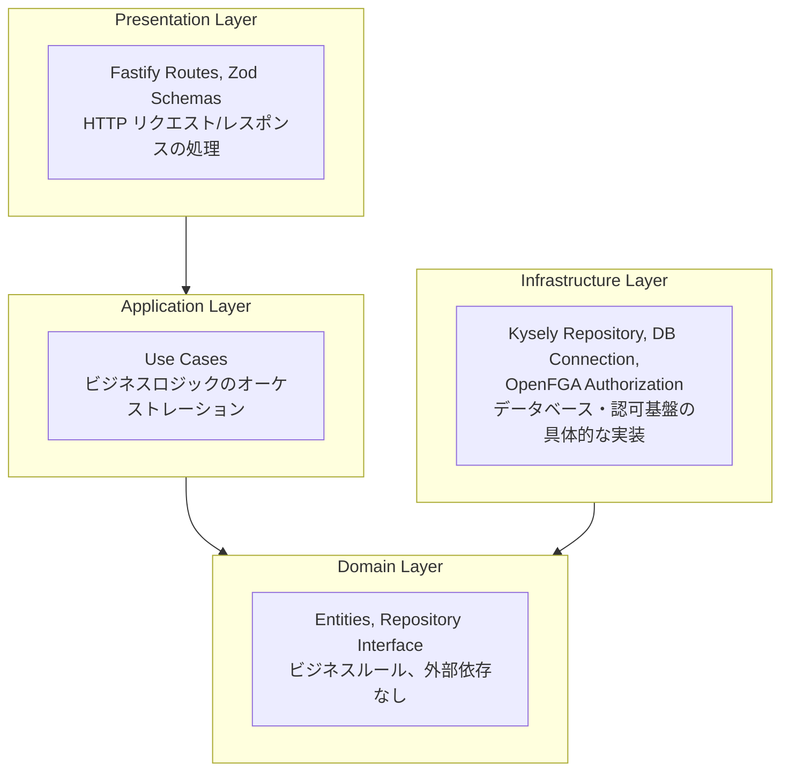

# アーキテクチャ

```mermaid
graph TD
    subgraph Presentation["Presentation Layer"]
        P["Fastify Routes, Zod Schemas<br/>HTTP リクエスト/レスポンスの処理"]
    end

    subgraph Application["Application Layer"]
        A["Use Cases<br/>ビジネスロジックのオーケストレーション"]
    end

    subgraph Domain["Domain Layer"]
        D["Entities, Repository Interface<br/>ビジネスルール、外部依存なし"]
    end

    subgraph Infrastructure["Infrastructure Layer"]
        I["Kysely Repository, DB Connection,<br/>OpenFGA Authorization<br/>データベース・認可基盤の具体的な実装"]
    end

    Presentation --> Application --> Domain
    Infrastructure --> Domain
```

**依存の方向**: Presentation → Application → Domain ← Infrastructure

Domain 層は外部ライブラリに一切依存しません。Infrastructure 層が Domain 層の Repository インターフェースと Authorization インターフェースを実装します（依存性逆転の原則）。
