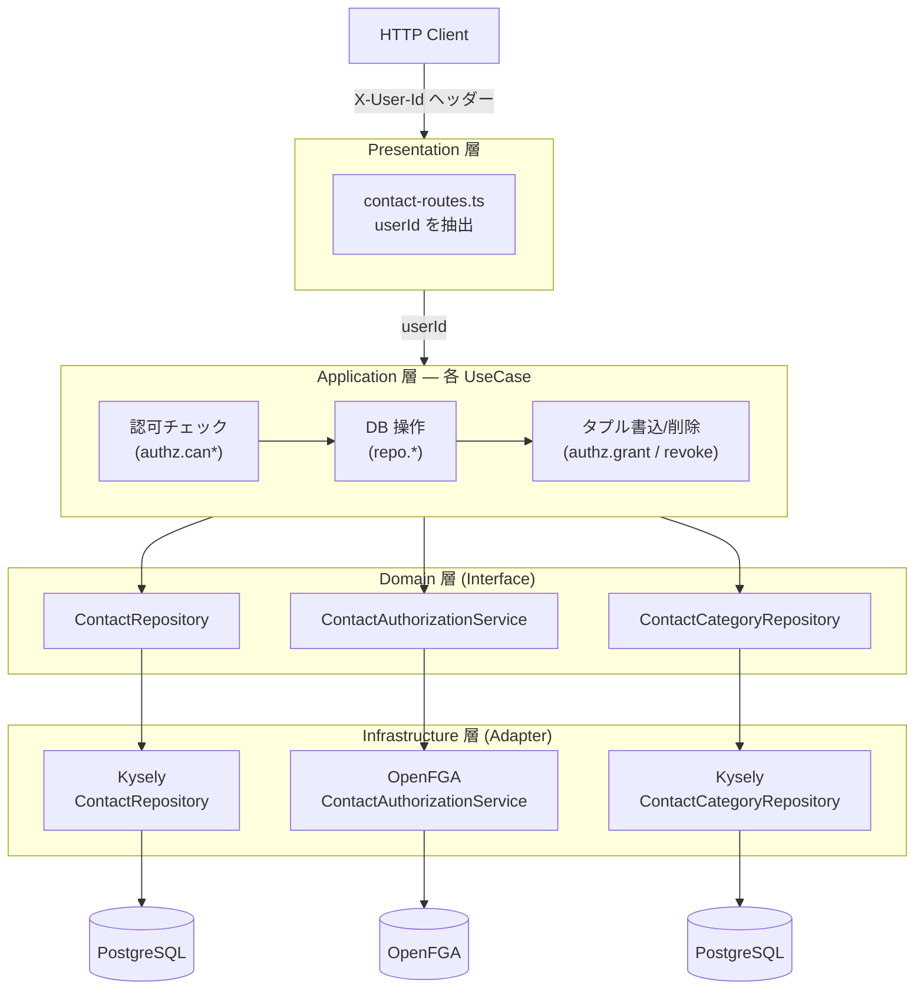

# 認可 (OpenFGA)

本 API は [OpenFGA](https://openfga.dev/) による Relationship-Based Access Control (ReBAC) で認可を行います。

## 認可アーキテクチャ

認可はヘキサゴナルアーキテクチャの Driven Port / Adapter パターンに従い、ドメイン層が技術に依存しない形で実装されています。



**設計のポイント:**

- **Driven Port（`ContactAuthorizationService`）** はドメイン層に定義されたインターフェースで、`canView` / `canEdit` / `canDelete` / `listViewableContactIds` / `grantOwnership` / `revokeOwnership` というドメイン用語のメソッドを持つ。OpenFGA の概念（relation, tuple, object）はドメイン層に漏れない
- **Driven Adapter（`OpenFgaContactAuthorizationService`）** がインフラ層でこのインターフェースを実装し、OpenFGA SDK への API 呼び出しに変換する
- **テスト用 Adapter（`InMemoryContactAuthorizationService`）** は `Set<string>` でタプルを管理するインメモリ実装。DB テスト・ユニットテストとも OpenFGA サーバー不要で動作する
- **Composition Root（`server.ts`）** で本番は OpenFGA アダプタ、テストはインメモリアダプタを注入する

## 認可の処理フロー（例: 問い合わせ作成）

```
1. POST /contacts  (X-User-Id: alice)
2. contact-routes.ts  → userId = "alice" を抽出
3. CreateContactUseCase.execute("alice", input)
4.   → contactRepository.create(input)          → PostgreSQL に INSERT → contact.id = 42
5.   → authorizationService.grantOwnership("alice", 42)
6.       → OpenFGA に 2 タプル書込:
7.           user:alice  #owner   contact:42     (alice は contact:42 の owner)
8.           system:global #system contact:42     (admin 継承用の parent リンク)
9. レスポンス: 201 Created
```

## 認証

すべての `/contacts` エンドポイントは `X-User-Id` リクエストヘッダーが必須です。ヘッダーが未設定の場合は `401 Unauthorized` を返します。

`/contact-categories` と `/health/*` は認証不要です。

## 認可モデル

```
type user

type system
  relations
    define admin: [user]

type contact
  relations
    define system: [system]
    define owner: [user]
    define editor: [user] or owner or admin from system
    define viewer: [user] or editor or admin from system
    define can_view: viewer
    define can_edit: editor
    define can_delete: owner
```

## リレーションと権限

| リレーション | 説明 |
|-------------|------|
| `contact#owner` | 問い合わせの作成者。閲覧・編集・削除すべて可能 |
| `contact#editor` | 編集者。owner および system admin から継承 |
| `contact#viewer` | 閲覧者。editor から継承、system admin からも継承 |
| `system#admin` | 管理者。全 contact に対して閲覧・編集権限を持つ |

## 認可の動作

- **POST /contacts** — 作成後、作成者に `owner` リレーションを付与
- **GET /contacts** — ユーザーが `can_view` を持つ contact のみ返却（`listObjects` API）
- **GET /contacts/:id** — `can_view` チェック。権限なしで `403`
- **PATCH /contacts/:id/status** — `can_edit` チェック。権限なしで `403`
- **DELETE /contacts/:id** — `can_delete` チェック。権限なしで `403`。削除後にタプルも削除

## admin ユーザーの設定

```bash
# openfga:setup 実行時に --admin-user オプションで初期 admin を設定可能
npm run openfga:setup -- --admin-user admin-user-id
```
